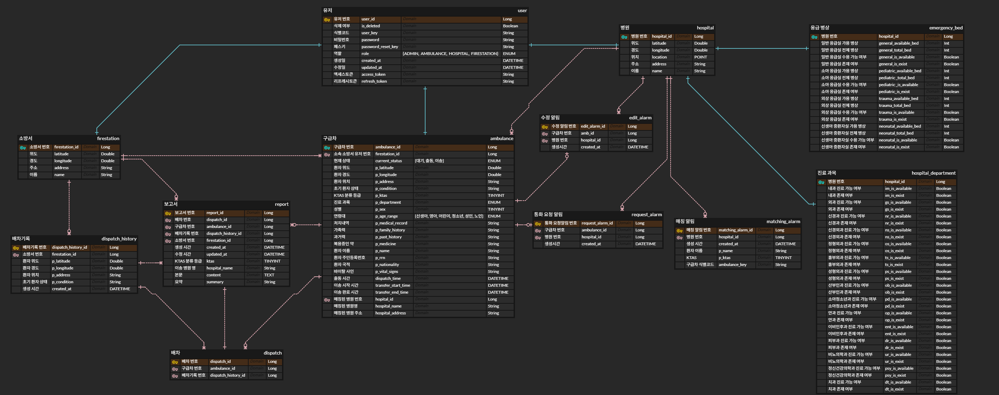
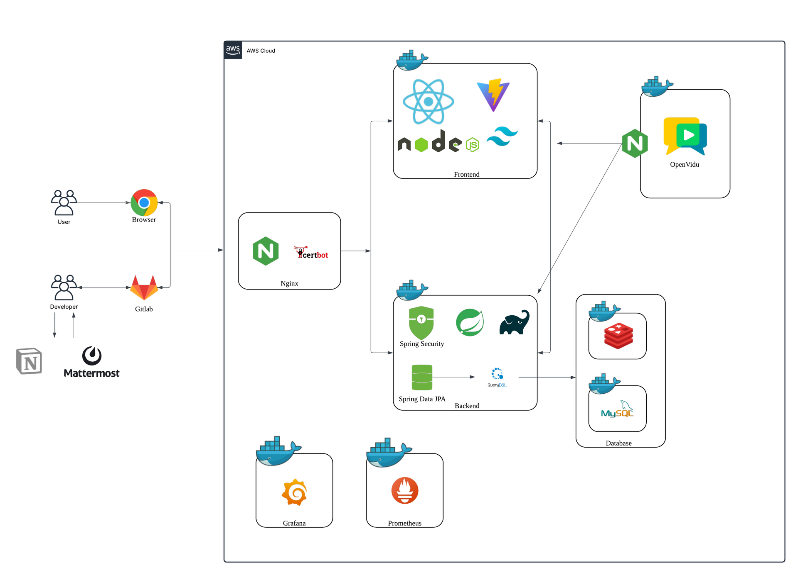
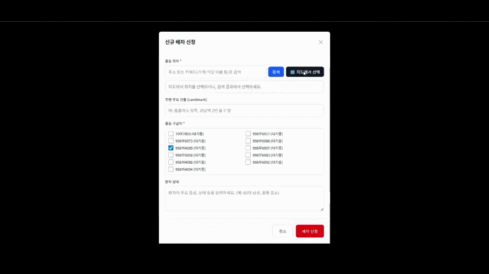
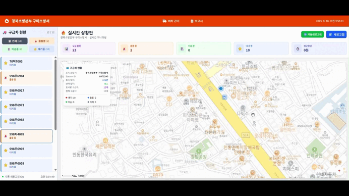
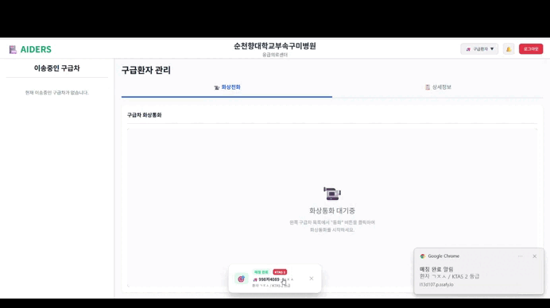
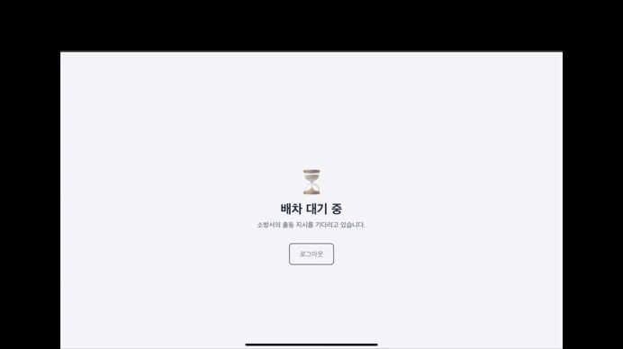
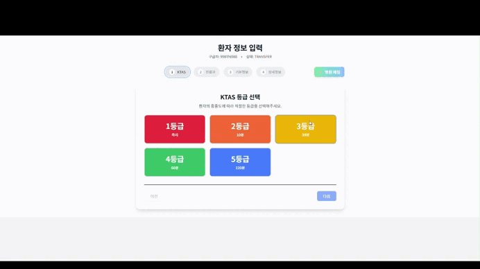

# 🚑 [AIDERS](https://i13d107.p.ssafy.io/) – AI 지원 응급환자 이송·병원 매칭 시스템
> **A**I-assisted    
> **I**ntegrated    
> **D**ispatch &     
> **E**mergency    
> **R**esponse    
> **S**ystem     
> 응급환자 이송 중 AI와 실시간 통신을 활용하여 **병원 자동 매칭**, **환자 상태 모니터링**, **위치 추적**을 지원하는 시스템

## 🔗 AIDERS 링크
https://i13d107.p.ssafy.io/

---
## ⏰ 프로젝트 진행 기간
**2025.07.14 ~ 2025.08.19** (6주)  
SSAFY 13기 2학기 공통프로젝트 - AIDERS

---


## 📖 프로젝트 소개
현장 구급대원이 응급환자를 이송할 때,  
병원의 수용 가능 여부를 실시간으로 확인하고, 자동으로 매칭하며,  
WebRTC를 통해 환자의 상태를 **영상·음성**으로 공유할 수 있는 시스템입니다.

또한, OCR 지원 입력 기능과 실시간 위치 추적을 통해 의료진이  
환자 도착 전 필요한 인력과 장비를 사전에 준비할 수 있도록 돕습니다.

---

## 🚀 주요 기능
- **병원 자동 매칭** – 환자 상태와 병상 현황을 기반으로 최적 병원 자동 추천
- **실시간 영상 통화(WebRTC)** – 구급차 ↔ 병원 간 영상/음성 공유
- **OCR 지원 환자 정보 입력** – 필기/이미지를 AI로 인식하여 자동 입력
- **실시간 위치 추적** – 구급차 GPS 데이터 병원 및 소방서 상황판에 표시
- **실시간 환자 상태 확인** – 이송 중 입력된 환자 상태를 실시간으로 확인

---

## 🛠 기술 스택

### **Backend**


### **Database & Cache**


### **Frontend**


### **AI/OCR**


### **실시간 통신**


### **Infrastructure & DevOps**


### **Communication**


## 📂 폴더 구조
```
S13P11D107/
├── aiders-backend/       # Spring Boot 서버
├── aiders-frontend/      # React 프론트엔드
├── prometheus/           # 서버 모니터링을 위한 prometheus
├── docker-compose.yml    # 통합 실행 환경
└── README.md
```

### Backend
```
aiders
├── application
│   ├── alarm
│   │   ├── controller
│   │   ├── dto
│   │   ├── entity
│   │   ├── repository
│   │   └── service
│   ├── ambulance
│   │   ├── controller
│   │   ├── dto
│   │   ├── entity
│   │   ├── repository
│   │   └── service
│   ├── auth
│   │   ├── controller
│   │   ├── dto
│   │   │   ├── login
│   │   │   └── token
│   │   ├── repository
│   │   └── service
│   ├── dispatch
│   │   ├── controller
│   │   ├── dto
│   │   ├── entity
│   │   ├── repository
│   │   └── service
│   ├── firestation
│   │   ├── controller
│   │   ├── dto
│   │   ├── entity
│   │   ├── repository
│   │   └── service
│   ├── hospital
│   │   ├── controller
│   │   ├── dto
│   │   │   ├── department
│   │   │   └── emergencybed
│   │   ├── entity
│   │   ├── repository
│   │   ├── service
│   │   └── util
│   ├── location
│   │   ├── controller
│   │   ├── dto
│   │   └── service
│   ├── match
│   │   ├── controller
│   │   ├── dto
│   │   └── service
│   ├── openvidu
│   │   ├── controller
│   │   ├── dto
│   │   └── service
│   ├── report
│   │   ├── ai
│   │   ├── controller
│   │   ├── dto
│   │   ├── entity
│   │   ├── repository
│   │   └── service
│   └── user
│       ├── controller
│       ├── dto
│       │   ├── ambulance
│       │   ├── organization
│       │   └── password
│       ├── entity
│       ├── repository
│       └── service
├── common
│   ├── jwt
│   └── util
├── config
│   ├── security
│   └── websocket
└── redis
   ├── controller
   ├── handler
   └── service
```
### Frontend
```
aiders-frontend
├── node_modules
├── public
└── src
    ├── api
    ├── assets
    │   └── icon
    ├── components
    │   ├── admin
    │   ├── Emergency
    │   │   ├── Layout
    │   │   ├── modals
    │   │   └── PatientInput
    │   ├── FireStation
    │   │   ├── Layout
    │   │   └── modals
    │   ├── hospital
    │   ├── login
    │   └── webRTC
    ├── context
    ├── hooks
    ├── pages
    │   ├── Emergency
    │   ├── FireStation
    │   └── hospital
    ├── router
    ├── services
    ├── store
    └── utils
```

## 👥 팀원 소개

|                                                                                          |                                                                            |                                                                                    |                                                                           |                                                                            |                                                                          |
|:------------------------------------------------------------------------------------------------------:|:------------------------------------------------------------------------------------------------:|:---------------------------------------------------------------------------------------------------:|:------------------------------------------------------------------------------------------:|:-------------------------------------------------------------------------------------------:|:-----------------------------------------------------------------------------------------:|
|                                        **박상준**<br/>(PM / Infra)                                        |                                      **이창환**<br/>(Backend)                                       |                                        **박원준**<br/>(Backend)                                        |                                   **김정수**<br/>(Frontend)                                   |                                   **박재연**<br/>(Frontend)                                    |                                   **김채일**<br/>(AI/OCR)                                    |
| **Infra**<br/>AWS EC2<br/>Docker<br/>Nginx<br/>SSL<br/>**Backend**<br/>Spring Boot<br/>MySQL<br/>Redis | **Backend**<br/>Spring Boot<br/>Spring Data JPA<br/>QueryDSL<br/>MySQL<br/>병원 추천 알고리즘<br/>API 설계 | **Backend**<br/>Spring Boot<br/>Spring Data JPA<br/>QueryDSL<br/>MySQL<br/>병원 추천 알고리즘<br/>WebSocket | **Frontend**<br/>React 18<br/>TailwindCSS<br/>WebRTC<br/>OpenVidu<br/>사용자 UI/UX<br/>실시간 통신 | **Frontend**<br/>React 18<br/>TailwindCSS<br/>WebRTC<br/>OpenVidu<br/>사용자 UI/UX<br/>컴포넌트 설계 | **AI/OCR**<br/>PyTorch<br/>ONNX Runtime<br/>OpenCV<br/>CRNN 모델<br/>온디바이스 처리<br/>AI 모델 최적화 |


---
## 📊 ERD Diagram



[📋 Porting Manual](./exec/Porting_Manual.pdf)

---

## 🏗 시스템 아키텍처


**구성 요소**
- **클라이언트(구급차 / 병원 / 소방서 상황판)**: React 기반 UI, WebRTC 미디어 송수신
- **시그널링 서버**: OpenVidu(또는 자체 WebRTC 시그널링)로 통화 세션 관리
- **백엔드 API 서버**: Spring Boot — 환자/병원 데이터, 매칭·세션·알림 도메인
- **매칭 엔진**: 병상 현황·거리·응급도 점수화 → 최적 병원 추천
- **AI/OCR 서빙**: ONNX Runtime/CRNN으로 필기·이미지 인식
- **데이터베이스**: MySQL(영속), Redis(세션/캐시)
- **모니터링**: Prometheus, Grafana
- **배포/네트워크**: Docker, Nginx 리버스 프록시
---
## AIDERS 서비스 화면

### 소방서 화면

**소방서 앰뷸런스 배차**    


**소방서 앰뷸런스 모니터링**    


**응급환자 이송 후, AI 보고서 작성**    


### 병원 화면

**환자 배정 시 알람**   


**환자와 WebRTC 통화**  


### 앰뷸런스 화면

**앰뷸런스 대기 -> 배차 화면**  


**앰뷸런스 입력화면**   


**앰뷸런스 WebRTC 통화**    

